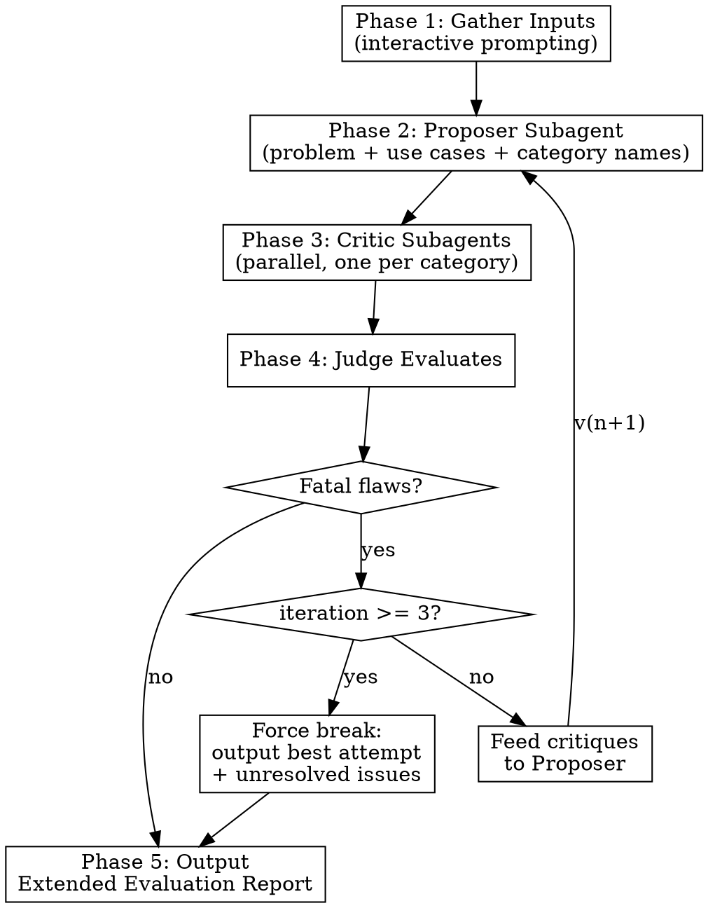

# Universal Multi-Agent Expert Panel

## Overview

Adversarial multi-agent evaluation for complex technical decisions. A **Proposer** drafts solutions from first principles, isolated **Critics** attack from their constraint domains, and a **Judge** (you, the main session) arbitrates until trade-offs are balanced or the iteration limit is reached.

**Core insight:** Separation of concerns prevents groupthink. The Proposer never sees constraint documents. Each Critic sees only its own domain. No agent has the full picture — only the Judge synthesizes.

## When to Use

- Architecture decisions with multiple competing constraints (security vs. usability vs. cost)
- API design under regulatory, security, or performance tension
- Deployment strategies with risk trade-offs across domains
- Technology selection where different stakeholders have conflicting priorities

**Do NOT use for:** Single-constraint decisions, code-level implementation choices, style preferences, or decisions where one option is clearly dominant.

## The Process



---

## Phase 1: Gather Inputs

Use AskUserQuestion to collect inputs interactively. Gather these in order:

1. **Problem statement** — Ask: "What technical decision do you need to evaluate? Describe the problem in 1-3 sentences."
2. **Use cases** — Ask: "What are the key use cases or scenarios this decision must support? Provide file paths or describe inline."
3. **Constraint categories** — Ask: "What constraint domains should the panel evaluate against? For each, provide a category name and file path to the relevant documentation."
   - Example categories: `security`, `compliance`, `performance`, `cost`, `operability`
   - Example file paths: `docs/security-policy.md`, `docs/dnv-regulations.md`
   - Keep asking until the user confirms all categories are listed
4. **Confirm** — Summarize all inputs and ask for confirmation before proceeding.

Store the collected inputs as:
- `PROBLEM`: the problem statement text
- `USE_CASES`: file contents or inline text
- `CATEGORIES`: list of `{name, file_path}` pairs

---

## Phase 2: Proposer Subagent

Spawn a single Agent subagent with the Proposer prompt. The Proposer is **category-aware but document-blind** — it knows the dimension names it will be evaluated on, but never sees the actual constraint documents.

### Proposer Prompt Template

```
You are a Solution Proposer for a technical decision evaluation.

## Your Task
Draft a structured technical proposal for the following problem.

## Problem
{PROBLEM}

## Use Cases
{USE_CASES}

## Evaluation Dimensions
Your proposal will be evaluated by independent critics in these domains: {CATEGORY_NAMES_ONLY}
Design your solution to be defensible across all of these dimensions, but use your best judgment — you do NOT have access to the specific constraint documents.

## YOU MUST NOT
- Ask to see constraint documents
- Guess at specific rules or policies
- Optimize for one dimension at the expense of others without justification

## Required Output Format
### Proposed Solution
[Clear description of the approach]

### Key Design Choices
[Numbered list of choices with rationale for each]

### Alternatives Considered
[2-3 alternatives you rejected, with brief reason why]

### Known Risks
[Risks you anticipate, even without seeing constraint docs]
```

Read the Proposer's output and store it as `PROPOSAL_V{n}`.

---

## Phase 3: Critic Subagents (Parallel)

Spawn one Agent subagent per constraint category **in a single message** (parallel dispatch). Each Critic receives ONLY the proposal and its own constraint document. Critics must NOT see each other's domains or documents.

### Critic Prompt Template (one per category)

```
You are the {CATEGORY_NAME} Critic on a technical decision evaluation panel.

## Your Role
Evaluate the following proposal STRICTLY from the perspective of {CATEGORY_NAME}. You represent this domain and no other.

## Proposal Under Review
{PROPOSAL_V_N}

## Your Constraint Document
{CONTENTS_OF_CATEGORY_FILE}

## YOU MUST NOT
- Evaluate outside your domain (e.g., if you are the Security Critic, do not comment on cost)
- Communicate with other critics
- Propose a complete alternative solution — only identify issues

## Required Output Format
### Fatal Flaws
[Issues that MUST be fixed — the proposal cannot proceed as-is. If none, write "None identified."]

### Warnings
[Issues that SHOULD be fixed — significant concerns but not blocking. If none, write "None identified."]

### Acceptable Risks
[Aspects that are suboptimal for {CATEGORY_NAME} but represent reasonable trade-offs. If none, write "None identified."]

### Specific Recommendations
[Concrete, actionable changes to address the fatal flaws and warnings above]
```

Collect all critic outputs. Store as `CRITIQUES_V{n}`.

---

## Phase 4: Evaluation Loop

You (the Judge) read all critiques and decide the next action.

### Decision Logic

**Check for fatal flaws across ALL critics:**

- **No fatal flaws from any critic** → Proceed to Phase 5 (output).
- **Fatal flaws exist AND iteration < 3** → Synthesize all critiques into a revision brief. Re-dispatch the Proposer with the original problem + use cases + category names + the revision brief. Then re-dispatch Critics against the new proposal. Increment iteration counter.
- **Fatal flaws exist AND iteration >= 3** → **Force break.** Proceed to Phase 5 but flag unresolved fatal flaws in the output.

### Revision Brief Template (for Proposer re-dispatch)

```
You are revising your proposal based on expert critique. This is revision {N} of max 3.

## Original Problem
{PROBLEM}

## Use Cases
{USE_CASES}

## Evaluation Dimensions
{CATEGORY_NAMES_ONLY}

## Your Previous Proposal (v{N-1})
{PROPOSAL_V_N_MINUS_1}

## Critiques Received
{ALL_CRITIQUES_CONCATENATED — include critic category labels}

## Instructions
- Address ALL fatal flaws identified by critics
- Address warnings where feasible without creating new fatal flaws
- Explain what changed and why in your revision notes
- You still do NOT have access to the constraint documents — work from the critique feedback

## Required Output Format
[Same as original Proposer format, plus:]

### Revision Notes
[What changed from v{N-1} and why, referencing specific critiques]
```

---

## Phase 5: Final Output

Output the Extended Evaluation Report directly in the conversation.

### Report Template

```markdown
# Expert Panel: {DECISION_TITLE}

## Executive Summary
[2-3 sentences: the decision, the chosen approach, and the confidence level]
[If force-broken at iteration limit, state: "Evaluation reached maximum iterations with unresolved concerns — see Open Questions."]

## Chosen Solution
[Final proposal description]

### Key Design Choices
[From the final proposal version]

## Alternatives Considered
| Alternative | Summary | Why Rejected |
|-------------|---------|--------------|
| {alt_1}     | ...     | ...          |
| {alt_2}     | ...     | ...          |

## Critic Evaluations

### {Category_1}
| Aspect | Assessment | Detail |
|--------|-----------|--------|
| ...    | Fatal / Warning / Acceptable / Resolved | ... |

### {Category_2}
| Aspect | Assessment | Detail |
|--------|-----------|--------|
| ...    | Fatal / Warning / Acceptable / Resolved | ... |

[Repeat for each category]

## Accepted Trade-offs
- [Trade-off 1: what was sacrificed, in which domain, and why it's acceptable]
- [Trade-off 2: ...]

## Open Questions
- [Unresolved concerns, if any — especially from force-break scenarios]
- [Areas requiring further investigation or human judgment]

---
*Panel composition: {N} critics ({category_list}). Iterations: {iteration_count}/3.*
```

---

## Common Mistakes

| Mistake | Why It's Wrong | Fix |
|---------|---------------|-----|
| Leaking constraint docs to Proposer | Defeats the first-principles forcing function | Only pass category NAMES, never file contents |
| Giving critics cross-domain context | Critics become generalists, diluting expertise | Each critic gets ONE constraint file only |
| Treating all warnings as fatal | Inflates iteration count, wastes tokens | Only fatal flaws trigger re-dispatch |
| Skipping the confirmation step | Wrong inputs cascade through all agents | Always confirm inputs before Phase 2 |
| Vague problem statements | Proposer produces generic solutions | Push back — ask user to be specific |
| Ignoring "Acceptable Risks" | Loses nuance in the final report | Include them — they document conscious trade-offs |
