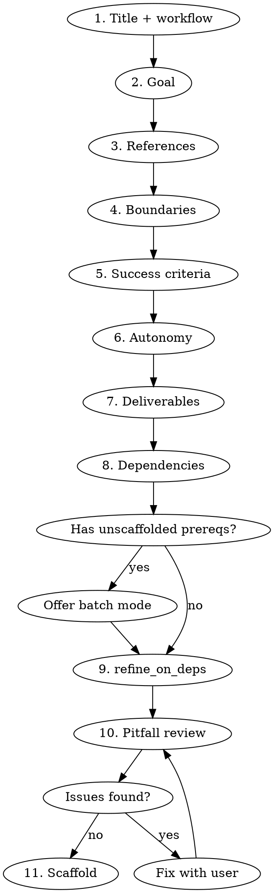

# SimpleHarness Task Authoring

Walk the user through writing a high-level task brief that SimpleHarness can
execute without human review of the plan. The brief must be short but precise
enough that the downstream plan cannot drift.

**Before you begin:** Read `cli-reference.md` (in this skill's directory) for
the full CLI command reference, TASK.md schema, workflow descriptions, and
directory structure. You should not need to look into the simpleharness source
code.

## Modes

Ask up front: **single** (one task) or **batch** (multiple related tasks with
dependencies). Recommend batch when the user describes work with dependency
edges.

## Single-task flow



Walk through each step **one question at a time**. Challenge weak answers.

### Step details

1. **Title + workflow** — Short imperative title. Guide workflow choice:
   - Research / spike / exploration -> `universal`
   - Refactor / feature / bugfix -> `feature-build`
   - Feature with local Ollama execution -> `feature-build-local`
   - Feature with Opus planning + local loop execution -> `feature-build-hybrid`
   For hybrid: task must be decomposable into independent steps with clear
   acceptance criteria. The plan-writer will produce PLAN.md with `## Step N`
   headings, each with contracts, tests, and a quality wishlist.

2. **Goal** — One paragraph describing the *outcome*, not the steps. Reject
   vague words: "improve", "clean up", "better", "enhance" need a measurable
   endpoint. Ask: "how would you know this is done?"

3. **References** — Which files/docs are the authoritative specification for
   this work? Push for specific paths (`docs/architecture.md`), not "the
   codebase". Help by searching the worksite with Glob/Grep if needed.

4. **Boundaries** — Explicit "do not touch" list. Prompt: "what adjacent
   code or systems should be left alone?" Also: "any existing behavior that
   must not change?"

5. **Success criteria** — Checklist of objectively testable items. Each must
   reference a file, command, test, or observable output. **Highest-friction
   gate.** Reject adjective-only criteria ("code is clean", "tests are good").
   Good examples: "`uv run pytest` exits 0", "file `docs/X.md` exists with
   sections A, B, C", "no regressions in `git diff` of public API".

6. **Autonomy** — Walk through: "what decisions might arise during planning
   and implementation?" Sort each into:
   - **Pre-authorized**: agent decides and proceeds (naming, internal structure,
     test approach within the project's existing stack)
   - **Must block**: agent stops and writes BLOCKED.md (new dependencies,
     public API changes, scope expansion)
   For `feature-build` workflow, refuse to finalize with an empty Autonomy
   section.

7. **Deliverables** — "What files or branches will this task produce?" Required
   if any downstream task will reference the output. Each deliverable has a
   `path` and `description`.

8. **Dependencies** — "Does this require anything done first?" List task slugs.
   If a prerequisite doesn't exist as a task yet, offer to switch to batch mode.

9. **refine_on_deps_complete** — Only relevant if `depends_on` is non-empty.
   Explain the tradeoff:
   - `true`: upstream's project-leader may append concrete details to this
     brief when the upstream task finishes. More hands-off.
   - `false`: this task blocks when deps finish. User re-briefs with the skill
     before it can start. Safer, user keeps control of acceptance criteria.

10. **Pitfall review** — Read the assembled draft and flag:
    - Vague goal (adjectives without metrics)
    - Unverifiable success criteria
    - Missing deliverables that a downstream task references
    - Empty Autonomy on a `feature-build` task
    - Circular dependencies

11. **Scaffold** — Run `simpleharness new "<title>" --workflow=<workflow>`,
    then overwrite TASK.md with the fully populated content.

## Batch flow

1. User describes the overall goal / set of related work.
2. Help decompose into 2-N component tasks. Propose the dependency graph.
3. Run the single-task flow for each task in **producer -> consumer** order
   (tasks with no deps first, then their dependents).
4. **Cross-task review**: every `references` path that points to a deliverable
   is declared by exactly one upstream. No dangling refs. Dep graph is acyclic.
5. Scaffold all tasks.

## TASK.md schema reference

See `examples/` for complete examples. Quick reference:

**Frontmatter:**
```yaml
title: "Human-readable title"
workflow: feature-build | universal
worksite: .
depends_on: []
deliverables:
  - path: docs/report.md
    description: "Decision report"
refine_on_deps_complete: false
references:
  - docs/architecture.md
```

**Body sections:** `# Goal`, `## Success criteria`, `## Boundaries`,
`## Autonomy`, `## Handoff`, `## Notes`

## Common mistakes

| Mistake | Fix |
|---------|-----|
| Goal describes steps, not outcome | Rewrite as "the state of the world when done" |
| Success criterion: "code is clean" | Replace with "`uv run ruff check .` exits 0" |
| Boundaries section empty | Prompt for adjacent code that should stay untouched |
| Autonomy section empty on feature-build | Walk through likely decisions; refuse to finalize |
| Deliverable path not declared by upstream | Add it to upstream's `deliverables` frontmatter |
| Circular dependency | Restructure: extract shared prereq into its own task |
