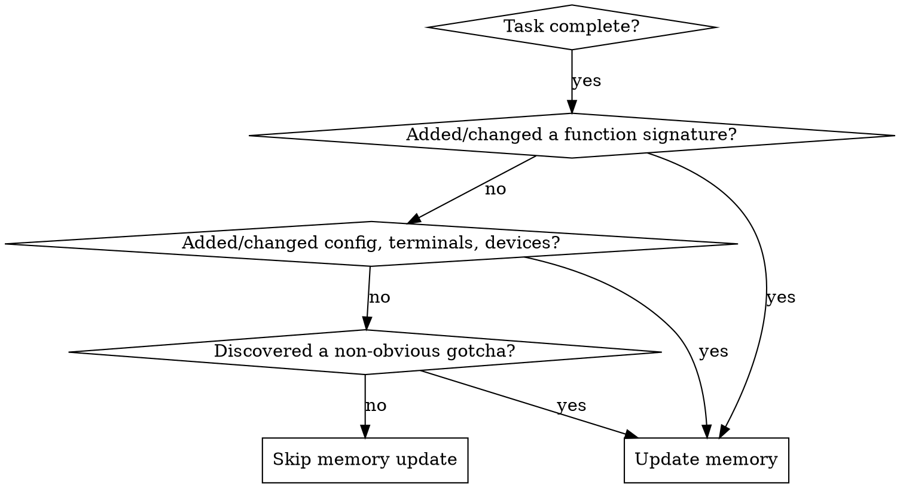

# Updating Memory

## Overview

The MCP memory server is the primary knowledge cache for all projects. Stale or missing entries force future agents to re-explore source files, wasting context window and time. **Every code change that affects something stored in memory must be reflected in memory.**

## When to Use

**After completing a task, before committing, ask yourself:**



**Update when you:**
- Added or changed a function/method signature
- Added or modified a class, dataclass, or type
- Changed project config (terminals, devices, PLC modules, constants)
- Added a new circuit, device template, or external connection
- Modified an API or library interface
- Discovered a non-obvious pattern, gotcha, or architectural decision

**Skip when:**
- Change was purely cosmetic (formatting, comments)
- Only modified internal logic without changing interfaces
- Fix was trivial and self-evident from the code

## Process

### 1. Search Before Writing

Always search memory first to find existing entities that need updating rather than creating duplicates.

```
mcp__memory__search_nodes("function_name")
mcp__memory__search_nodes("module_name")
```

### 2. Update or Create

**If entity exists** — use `mcp__memory__add_observations` to update with new information, or `mcp__memory__delete_observations` to remove stale info first.

**If entity is new** — use `mcp__memory__create_entities` with:
- `name`: The function, class, config, or concept name
- `entityType`: Match existing types (Function, Class, ProjectConfig, Type, DeviceDefinition, etc.)
- `observations`: Full signature, parameters, return type, key behaviors

**If entity was deleted from code** — use `mcp__memory__delete_entities` to remove it.

### 3. Update Relations

If new entities relate to existing ones (e.g., a new function belongs to a module, a new device template is used by external connections), add relations with `mcp__memory__create_relations`.

## What to Store

| Change Type | Store |
|---|---|
| New function | Full signature, parameters with types, return type, brief purpose |
| Changed function | Updated signature, note what changed |
| New class/dataclass | Fields with types, key methods, frozen/mutable |
| New config entry | Name, type, value structure, where it's used |
| New device/terminal | All fields, pin prefixes, bridge info |
| API gotcha | The gotcha, why it's surprising, the correct approach |
| Architectural decision | What was decided, why, what alternatives were rejected |

## What NOT to Store

- Implementation details that are obvious from reading the code
- Temporary debugging findings
- Information already in CLAUDE.md
- Duplicate entries (search first!)

## Common Mistakes

| Mistake | Fix |
|---|---|
| Creating duplicate entities | Always `search_nodes` first |
| Storing stale signatures | Delete old observations before adding new |
| Forgetting to delete removed code | If you deleted a function, delete its entity |
| Overly verbose observations | Store signatures and key behaviors, not full implementations |
| Missing relations | New functions need `belongs_to` module relations |
