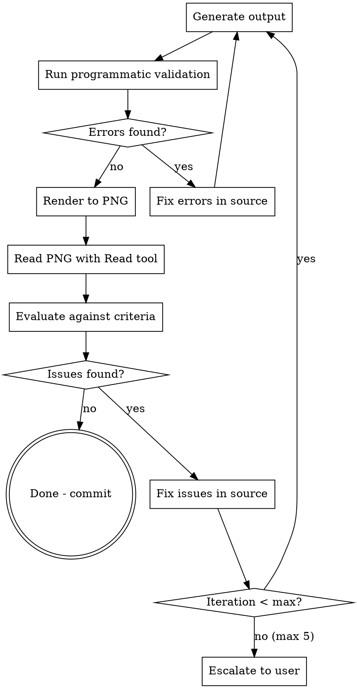

# Visual Self-Correction Loop

## Overview

You are blind to visual output. When generating SVGs, PDFs, or any rendered visual, you CANNOT judge layout quality from code alone. This skill gives you eyes: render to PNG, read it back, evaluate against criteria, fix, repeat.

## When to Use

- Generating diagrams, schematics, charts, or any visual layout
- Editing positions, sizes, or spacing in visual output code
- Any task where "does this look right?" matters

## Core Loop

## Step-by-Step

### 1. Generate Output
Run the generation script. Ensure it produces both the final format (PDF) and an intermediate inspectable format (SVG).

### 2. Programmatic Validation (if available)
Run any validation tools first — overlap detection, boundary checks, spacing. Fix all errors before visual review. This catches geometric issues instantly without burning visual review iterations.

### 3. Render to PNG
Convert the output to a PNG image the Read tool can display:
- **SVG**: Use `cairosvg`, Playwright, or project-specific render scripts
- **PDF**: Use PyMuPDF (`fitz`) to render pages to PNG
- **HTML**: Use Playwright screenshot

### 4. Read the PNG
Use the Read tool on the PNG file. You WILL see the image. This is your eyes.

### 5. Evaluate Against Quality Criteria
For EVERY visual review, evaluate these categories. Score each as PASS/FAIL with specific notes on what's wrong.

**Readability:**
- All text labels visible and readable (not cut off, not overlapping)
- Text size consistent and legible
- No text stacked on top of other text

**Layout:**
- No elements overlap each other
- Elements arranged in a logical spatial hierarchy
- Symmetry where expected (mirrored layouts)
- Whitespace used effectively — not too cramped, not too spread

**Connectivity (for diagrams):**
- All connections visually traceable from source to destination
- Connection styles (colors, dashes) match legend
- Connections don't unnecessarily cross

**Completeness:**
- All expected elements present
- Labels, legends, annotations present

**Reference Match (if reference exists):**
- Read the reference image too (render reference PDF page to PNG)
- Compare topology — same spatial arrangement?
- Same level of detail?

### 6. Fix Issues
For each FAIL, identify the specific code change needed:
- **Overlap**: Adjust x/y positions or increase spacing
- **Text unreadable**: Increase font size or block dimensions
- **Missing element**: Add to source code
- **Bad routing**: Adjust cable/connection waypoints

Make changes, then go to step 1.

### 7. Iteration Limit
**Max 5 iterations.** After 5, report remaining issues to the user with:
- What's working (PASS criteria)
- What's still broken (FAIL criteria with specifics)
- What you've tried
- What you think the fix is but couldn't achieve

## Red Flags — You're Doing It Wrong

- Making position changes without rendering and reading the PNG after
- Claiming "layout looks correct" without having READ the PNG image
- Skipping the PNG render because "the code changes are small"
- Not comparing against a reference when one exists
- Continuing past 5 iterations without escalating

**If you haven't read a PNG of your output, you don't know what it looks like. Period.**

## Quick Reference

| Output Type | Render Method | Read With |
|-------------|--------------|-----------|
| SVG | cairosvg / Playwright | Read tool (PNG) |
| PDF | PyMuPDF `fitz` | Read tool (PNG) |
| HTML | Playwright screenshot | Read tool (PNG) |

## Common Mistakes

| Mistake | Fix |
|---------|-----|
| Adjusting positions blind | ALWAYS render + read PNG after changes |
| Fixing one issue, creating another | Check ALL criteria each iteration, not just the one you fixed |
| Ignoring cable/connection routing | Connections are the hardest part — evaluate tracability explicitly |
| Not reading the reference | If a reference exists, render it to PNG and compare side-by-side |
| Over-iterating on small details | After 3 good iterations, minor tweaks rarely help — ship it |
